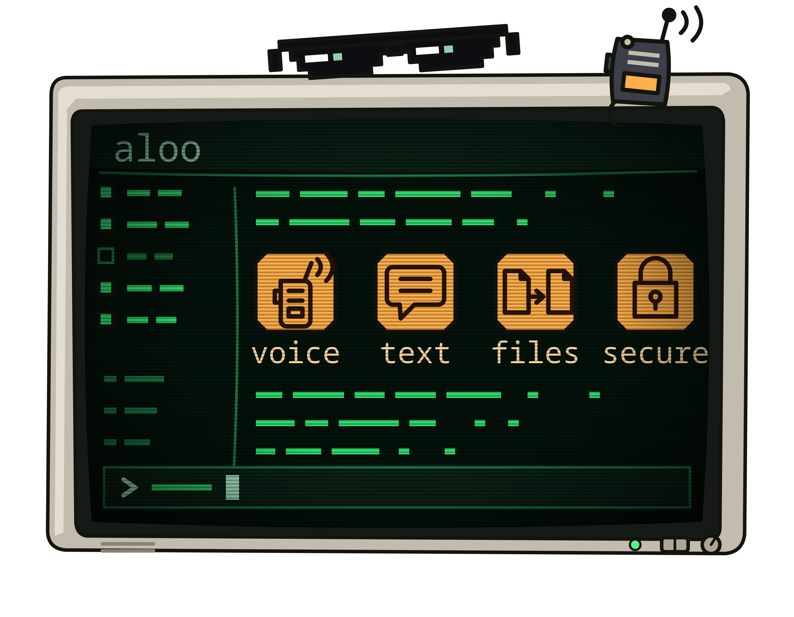

# aloo

<p align="center">

* Status ⚠️ ALPHA (under heavy development and testing)

</p>



*Equipped with One-Time-Pad encryption (perfect secrecy) and quantum-resistant hybrid encryption.*

Walky talky in your terminal! aloo is a terminal chat app for talking with people privately and securely — text, voice, and file sharing, all end-to-end encrypted, all running in your terminal. A server connects you with the people you talk to and helps your app punch a direct connection to theirs, but your actual messages travel peer-to-peer — the server never carries them, encrypted or otherwise. No accounts, no tracking.

Just you, your terminal, and the people you're talking to.

* [⬇️ Download](https://github.com/DavidValin/aloo/releases) (⭐ MacOS ⭐ Linux and ⭐ Windows supported)

## Features

- 🎙️ **Walkie-talkie voice messages** — hold `Space` from messages list or `Control+Alt+p` globally while in other app to talk, release to send it. Just like a real walkie-talkie, it auto-plays live on the other end as you're talking — no play button, nothing to tap, they just hear you. You can also replay it later: scroll to it in the log and press `Enter` to hear it again. `Ctrl+Alt+P` does the same thing globally, even while aloo isn't focused.
- 💬 **Text chat** — type and hit `Enter`, just like any chat app.
- 📎 **File transfer, with consent** — send files straight from the app with a built-in file browser, no external tools needed. The recipient sees a popup (with a chime) naming you and the file before a single byte moves, Accept focused by default; accepting streams it straight to `~/.aloo/downloads` with a live progress bar, no size cap.
- 📢 **Public channels** — join the channels the server advertises, shown as tabs across the top; a channel created after you connect shows up live, no reconnect needed.
- 🔒 **Private channels** — create or join a channel that isn't advertised to anyone; you just need to know its name, and optionally a password its creator set.
- ✉️  **Private messages (DMs)** — open a one-on-one conversation with anyone in the sidebar.
- 🔐 **Live One Time Pad sessions** — type `/otp` in a DM to wrap that conversation in real one-time-pad encryption, the only cipher with proven perfect secrecy, layered on top of the quantum-resistant encryption you already have. The pad is generated (or brought your own) per contact, the session starts only once both of you explicitly accept, and every message, voice clip and file in that room then travels pad-wrapped — still peer-to-peer, never through the server — with a live header showing both directions' remaining key. Requires [otp-toolkit](https://github.com/DavidValin/otp-toolkit) installed.
- 📨 **OTP mail (asynchronous) (** — write someone a whole mail (subject, text, voice recordings, file attachments) that waits for them even while they're offline: it's sealed under your shared one-time pad and parked on the server — which can't read a byte of it — until they next connect. Type `/mail` for the full-screen compose view and `/mailbox` for your mailbox, with each sent mail's delivery status and your received mail, readable in place. Needs a pinned recipient you share an `otp` pad with (see `/otp` below), with more pad left than the mail is long — the remaining key is shown live, top-right, as you write and attach.
- 🌐 **Server-coordinated, never server-carried** — the server tracks who's connected to which channel and helps two clients punch a direct connection to each other; once that's up, your messages, voice, and files travel peer-to-peer, never through the server at all. (OTP mail is the one deliberate exception: an already-pad-sealed blob the server stores, unreadably, until its recipient collects it.)

- 🛡️  **Everything above is end-to-end encrypted**. See the "Encryption" section below for how. You can go a step further with `/otp` in a DM: an optional, one-time-pad-encrypted session layered on top, active only once both of you explicitly accept it (requires [otp-toolkit](https://github.com/DavidValin/otp-toolkit) installed).
- 💾 **Chat history isn't saved to disk.** Text and voice messages only ever live in memory for as long as the app is running — close it or disconnect, and they're gone. A file you've accepted is the one exception: that's the point of a file transfer, so it's written to `~/.aloo/downloads`. OTP mail is the other, deliberate one: a received mail stays on disk — as ciphertext plus the pad to read it by, never plaintext — until you remove it from the mailbox, which destroys both.

## Getting started

### 1. Installation

* Easy way: [Download](https://www.github.com/aloo/releases)
* From git source code: `cargo build --release` (will be built at `target/release/aloo`)
* From crates.io: `cargo install aloo`
* If you need One Time Pad encryption, make sure the `otp` command is available on your system by installing [otp-toolkit](https://github.com/DavidValin/otp-toolkit)

### 2. Start (or join) a server

If someone already runs a server for you, skip to step 3 — you just need their host and port.

To run your own:

```sh
aloo --server                          # anyone can connect
aloo --server --password MYPASSWORD    # people need this password to connect
aloo --server --enc rsa server_key     # people need a matching RSA key to connect
```

The server always starts with one public channel called `the-hall`.

The server and everyone connecting to it must run the **same version** of aloo. There is no version negotiation on the wire (see `docs/PROTOCOL.md` §9), so a server left behind on an older release isn't slower or reduced — clients simply can't connect to it, failing on connect with a decode error. `aloo --help`'s first line reports the version on each side.

Whatever `--bind`/`--port`/`--password`/`--enc` you run it with gets saved to `~/.aloo/settings`; a bare `aloo --server` afterwards (e.g. after a crash) reuses the last configuration you started it with, auth included, instead of resetting to open access on the default port.

### 3. Connect

```sh
aloo
```

This opens a connect screen. Fill in the host/port, pick a nickname, and press Connect. Everything else on that screen has sensible defaults — you don't need to touch it to get started (see `docs/SPEC.md` if you want to know what every field does).

Your identity type is already set to `pq_hybrid` (PQ-Hybrid, see "Encryption" below) — no need to generate any keys yourself beforehand, aloo creates them automatically the first time you connect.

Nicknames are case-sensitive and must be free — if someone else is already connected with it, you'll be bumped back to this screen with an error, so just pick another one and try again. A nickname frees up the moment its holder disconnects — even an unclean disconnect (a crash, a lost network) is caught within 30 seconds, so a name is never stuck "in use" for good.

### 4. Chat away

- **Tab** moves you between the sidebar, the message log, and the compose bar.
- Type a message and press **Enter** to send it to the current channel.
- Press **Space** and hold it to record and send a voice message live — let go to stop.
- Press **Ctrl+Alt+P** to do the same thing from anywhere — even if aloo isn't the focused window. Enabled by default; edit `~/.aloo/settings` (`global_ptt_shortcut`, `global_ptt_enabled`) to change the combo or turn it off. Needs X11 on Linux — not available under Wayland.
- Type `/file` and press **Enter** to send a file.
- Type `/mail` to write an OTP mail, `/mailbox` to check your mail's delivery status and read what arrived (needs a shared `otp` pad — see `/otp` under "Encryption").
- Type `/leave` and press **Enter** to leave the selected channel — a private one's tab disappears, a public one stays (rejoin it with Enter) but you're no longer a member.
- Pick someone in the sidebar and press **Enter** to open a DM with them.
- Press `]` / `[` to switch between channel tabs, `Ctrl+J` to join or create a channel — public or private, optionally password-protected.
- Press `Ctrl+H` anytime for an in-app help screen with all of this.

## Encryption

Every message — text, voice, or file — is encrypted on your device before it ever leaves it, individually for each person who's meant to read it, and delivered directly to them over a peer-to-peer connection your two apps punch through NAT with the server's help. **The server never sees your messages at all** — not the plaintext, not even the encrypted bytes. It only helps clients find each other and keeps track of who's in which channel.

There are two separate places encryption shows up: how *you* prove who you are, and how *your messages* get locked. You pick both when you connect.

### Talking to the server (authentication)

How you prove you're allowed to connect:

- 🔓 **None** — anyone can connect, no questions asked.
- 🔑 **Password** — a shared password the server owner gives out.
- 🗝️ **RSA key** — the server owner hands you their public key file; only people with a matching key can connect.

### Your identity & message encryption

How your own messages get locked so only the intended reader can open them:

- 🚨 **PLAIN** (`None`) — a fresh key is generated for you automatically each time you connect. Simple, but nobody can tell it's really "you" across sessions.
- 🚨 **PWD** (`Password`) — your key is derived from a password, so the same password always gives you the same identity, from any machine.
- 🛡️ **PQH** (`PQ-Hybrid`, quantum-resistant) — the strongest option, and the **default**. It combines four things at once: ML-DSA-87 + RSA-4096 to sign and prove a message really came from you *and was meant for the person reading it*, ML-KEM-1024 + X25519 to securely share a one-time key, and AES-256-GCM to actually lock the message content. The keys that unlock your messages are also regenerated as you chat and the old ones thrown away, so someone who steals your key file later still can't read what you already said. Even if one of the newer post-quantum algorithms turns out to have a weakness someday, the classical RSA half still has to be broken too. You don't have to set anything up: if the keys don't exist yet, aloo generates them for you automatically the first time you connect.

These are the exact tags aloo shows next to a person's name, so you always know how someone's messages are protected just by looking at them.

| Tag | Method | Security level | Quantum-resistant? |
| --- | --- | --- | --- |
| 🚨 PLAIN | None | None | ❌ No |
| 🚨 PWD | Password | Basic | ❌ No |
| 🛡️ PQH | PQ-Hybrid | Ultra secure | ✅ Yes (as of today) |

Whichever identity type you and everyone else picks shows up as a little tag next to your name in the app, so it's always clear how a person's messages are being protected.

> **Heads up about PQH:** since it's the default, most people you meet will be using it — but it only talks to its own kind. A `PQH` user can message anyone, but can only *be messaged by* another `PQH` user. If a friend on `PLAIN`/`PWD` can't seem to reach you, that's why — one of you needs to switch to `pq_hybrid` too.

> **Going further with `/otp`:** on top of any `PQH` conversation, you can layer real one-time-pad encryption — perfect secrecy, the only cipher proven mathematically unbreakable when used correctly — for one DM at a time. It's not another identity type: nothing changes about your tag. Type `/otp` in a private message; if no shared pad exists for that contact yet, you're asked to either generate one and share it automatically over the already-encrypted `PQH` channel, or exchange it with them offline (run `otp` yourself and place the keys under `~/.aloo/otp/.keychain/`, then try `/otp` again) if you'd rather not send it over the network at all. Either way, the session only starts once your peer explicitly accepts too — from then on, every message in that room is additionally wrapped under the pad and shown with a 🛡️ prefix for as long as it stays active, and a 1-line header above the messages shows both directions' key position (sequence, offset, remaining MB) live, turning red per direction once it drops below 0.5MB. Requires [otp-toolkit](https://github.com/DavidValin/otp-toolkit) installed — see the in-app help (`Ctrl+H`) for the full flow.

By default, everything aloo writes to disk on its own — your auto-generated PQ-Hybrid keys, identity-pinning files, downloaded files — lives under `~/.aloo`. It never writes anywhere else unless you deliberately point a field (like a server RSA key file) somewhere else yourself. Set the `ALOO_HOME` environment variable to use a different directory instead — handy for running more than one client on the same machine (e.g. testing in separate terminals), since two clients sharing one `~/.aloo` would otherwise collide.

### Generating an RSA key for server authentication

Only needed if the server you're connecting to requires `--enc rsa`. Every identity type (`None`, `Password`, `PQ-Hybrid`) generates its own keys automatically; skip this otherwise.

```sh
openssl genpkey -algorithm RSA -pkeyopt rsa_keygen_bits:4096 -out key
openssl rsa -pubout -in key -out key.pub
```

`key` is the private key — pass it to `--enc rsa key` (server). `key.pub` is the matching public key — hand it out to clients.

## One Time Pad mail

A live `/otp` session needs both of you online at once — One Time Pad mail doesn't. Write someone a whole mail — subject, text, voice recordings, file attachments — and it waits for them:

* `/mail` — compose a mail that is delivered asynchronously, once the recipient connects
* `/mailbox` — read received mails, and follow each sent mail's delivery status (awaiting server / on server / delivered ✓)

**The server's role here — and how it differs from a `/otp` session.** Live `/otp` messages travel **peer-to-peer**: the server carries none of them, it only helps your two apps find each other. Mail can't work that way — the whole point is that the recipient may be offline — so this is the one deliberate exception where the server acts as a mailbox: it **stores** the mail on disk and **delivers** it when the recipient next connects, deletes its copy the moment they confirm it arrived, and holds the delivery receipt for you until you've seen it. What it stores is sealed under your shared one-time pad *before it ever leaves your machine*: the server holds no key material and cannot read a byte of it. And because a bare pad hides content but can't detect tampering, every mail also carries a signature from your durable identity — so the server (or anyone else who touches the blob) can't alter a bit undetected.

Both paths spend the **same** pad for that contact, in strict order, so a mail and your live `/otp` messages never decrypt out of sequence. Composing needs a pinned recipient you share an `otp` pad with (see `/otp` above) and more pad remaining than the whole mail is long — the compose view shows the remaining key live, top-right, as you write and attach. A received mail rests on your disk as ciphertext plus the pad to read it by (never plaintext) until you remove it from `/mailbox`, which destroys both.

## Knowing who you're really talking to

Nicknames aren't proof of identity — anyone could reconnect as "alice" the moment the real alice disconnects. To handle this, aloo remembers people the same way SSH remembers servers in `known_hosts`:

- The **first time** you see someone's nickname, aloo just trusts their key and quietly remembers it (pinned locally, never sent anywhere).
- **Next time** they show up with the *same* key, nothing happens — it's silently confirmed as the same person.
- If that nickname ever comes back with a **different, unrecognized key**, aloo blocks messaging with them right away and, a moment later — as soon as it knows how to reach this new connection — asks you: an identity review popup shows up with **Accept** or **Reject**, naming not just both keys' fingerprints but also where each connection came from: `Last known from <address> (device <id>)` next to `Now connecting from <address> (device <id>)`, so you have more than two fingerprints to judge a key change by. Until you decide, you can't send them anything, and any messages they send stay hidden instead of appearing in your log.
- **Accept** if you've confirmed it's really them (new device, lost their old key, etc.) — the new key is pinned from then on. **Reject** if you're not sure — nothing is trusted, and you can revisit the decision later by opening a chat with them again.
- The "device" shown above is a random id aloo generates once per machine (`~/.aloo/d_id`) and reuses forever — purely informational, sent to peers only so it can show up in this popup.

This only applies to identity types that actually stay the same across reconnects (`Password`, `PQ-Hybrid`) — the `None` type has no persistent identity to pin in the first place, so there's nothing to compare.

## Want the technical details?

This README is the friendly tour. For the full nuts and bolts:

- [`docs/SPEC.md`](docs/SPEC.md) — the complete application specification.
If you ever need to replace your keys, use `aloo --rekey-pq-hybrid <old-prefix> <new-prefix>` rather than generating a fresh set: the new keys carry a certificate signed by the old ones, so people who already know you won't be warned that you might be an impostor. And `aloo --export-identity-card <prefix> <your-nickname>` writes a small file you can send to a friend by any means — once they import it, they have you verified before you've even spoken.

- [`docs/SECURITY.md`](docs/SECURITY.md) — what aloo protects, what it does not, and how much of that is actually checked. Read this before trusting it with anything that matters.
- [`docs/PROTOCOL.md`](docs/PROTOCOL.md) — the wire protocol, message framing, and cryptographic design in full detail. Written without reference to any implementation, so it stands on its own if you want to build a second one; section 14 compares the four encryption methods side by side and section 15 collects every message sequence.
- [`docs/TESTING.md`](docs/TESTING.md) — how the project is tested.
- [`docs/SERVER_ON_DOCKER.md`](docs/SERVER_ON_DOCKER.md) — running `aloo --server` in Docker.
